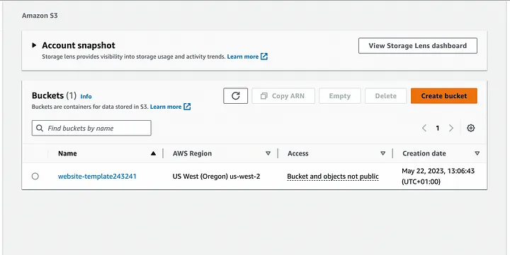
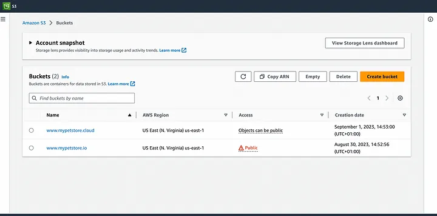
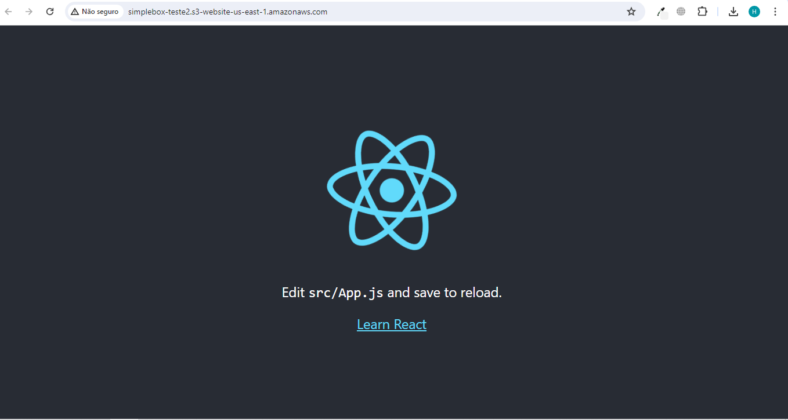

# Implantação de um aplicativo React usando o AWS S3

 ### Pré-requisitos:
 * Node.js e npm
 * Conta da AWS

### Passo 1: Crie um App React
Para criar um app, insira os seguintes comandos no terminal:

    npx create-react-app my-app
    cd my-app
    npm start
    npm run build

### Passo 2: Acesse o Ambiente Sandbox
* Entre na sua conta na AWS Academy e vá na aba Painel de Controle. Em seguida, acesso o curso AWS Academy Cloud Foundations [77207]

* Na aba Módulos, vá até o final da página e acesse o SandBox Environment.

* Você deverá ser direcionado para o Sandbox Environment.

* Na parte superior da página, selecione Start Lab (Iniciar laboratório) para iniciar o laboratório.

* Um painel Iniciar laboratório é aberto com o status do laboratório. Aguarde a mensagem Lab status: ready (Status do laboratório: pronto) ser exibida e, depois, feche o painel Iniciar laboratório clicando em X.

* Na parte superior, ao lado de Start Lab, selecione AWS.

* O Console de Gerenciamento da AWS abrirá em uma nova guia do navegador. O sistema fará o login automaticamente.

 ### Passo 3: implantar o aplicativo React no bucket do AWS S3

Abra o console da AWS e digite "Bucket" na barra de pesquisa.

* Selecione o serviço S3.

* Uma vez aberto, você deve ver uma página semelhante à imagem abaixo.

* Vá para o botão "Criar um bucket".

* Dê um nome ao seu balde. Vou chamar esse balde de "mypetstore.cloud", mas você pode usar qualquer nome de sua escolha.

* Especifique sua região preferida

* Habilite o acesso público ao bucket do S3 e salve. Vou deixar todas as outras opções por padrão.
* Seu bucket deve ter sido criado e deve aparecer no S3 como a imagem abaixo.

 * Navegue até o bucket que acabamos de criar, onde importaremos o conteúdo da pasta build no React App para nosso bucket do S3.

* Clique no botão "Adicionar arquivos", destaque todos os arquivos em nosso projeto build e adicione-os
* Em seguida, clique no botão "Adicionar pasta" e importe a pasta "estática" para o bucket do S3. 

* Os dados carregados devem se parecer com a imagem abaixo em nosso bucket do S3.

* Em seguida, vamos atualizar as propriedades do nosso bucket

* Role para baixo até a parte inferior até a opção "hospedagem estática de sites" e edite-a.

* Habilite a hospedagem estática de sites para nosso bucket do S3 e especifique "index.html" como a página padrão do seu projeto.

* Em seguida, navegue até as permissões de bucket do S3 que permitem atualizar as políticas.

* Role para baixo até a política de bucket e edite-a. Insira as seguintes configurações de política.

        {
            "Version": "2012-10-17",
            "Statement": [
                {
                    "Sid": "Statement1",
                    "Effect": "Allow",
                    "Principal": "*",
                    "Action": "s3:GetObject",
                    "Resource": "arn:aws:s3:::www.mypetstore.cloud/*"
                }
            ]
        }

* Certifique-se de substituir "recurso" pelo nome do bucket.

* Quando isso for concluído, navegue até as propriedades do bucket e role até a parte inferior, Você verá uma URL disponível para o nosso bucket.

* Copie o link e cole-o em um navegador.

* Seu aplicativo React deve ser capaz de carregar no navegador assim.

